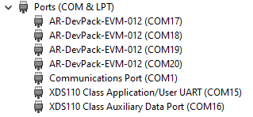
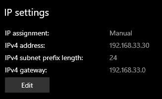
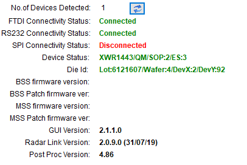

# MMWAVE SETUP \+ DEMO VISUALISER TUTORIAL

1. Download mmWave SDK   
   1. [https://www.ti.com/tool/MMWAVE-SDK](https://www.ti.com/tool/MMWAVE-SDK)  
   2. We use older Version 2.1.0 \-  is the known one to have an OOB demo for xWR1443  
   3. Docs are in mmwave\_sdk\_\<ver\>/docs/mmwave\_sdk\_user\_guide.pdf or:  
      [https://e2e.ti.com/cfs-file/\_\_key/communityserver-discussions-components-files/1023/7801.mmwave\_5F00\_sdk\_5F00\_user\_5F00\_guide.pdf](https://e2e.ti.com/cfs-file/__key/communityserver-discussions-components-files/1023/7801.mmwave_5F00_sdk_5F00_user_5F00_guide.pdf)

      

2. Install UniFlash to flash board  
   1. [https://software-dl.ti.com/ccs/esd/uniflash/docs/v9\_0/uniflash\_quick\_start\_guide.html](https://software-dl.ti.com/ccs/esd/uniflash/docs/v9_0/uniflash_quick_start_guide.html)  
   2. I downloaded 8.0 to match laura  
        
3. Determine ports  
   1. In Windows Device Manager, note the User UART and Data ports  
      

4. Flash board with demo binary:  
   1. (see “Flashing the board” section in the sdk user guide)  
   2. To flash, set jumpers to SOP0 and SOP2  
   3. Reset power  
   4. In Uniflash, select IWR1443 and flash mmwave\_sdk\_\<ver\>/packages/ti/demo/xwr14xx/mmw/xwr14xx\_mmw\_demo.bin  
   5. Remove SOP2 jumper  
   6. Reset power

5. Set up mmWave Visualizer  
   1. Link to Online Visualizer:  
      1. [https://dev.ti.com/gallery/view/mmwave/mmWave\_Demo\_Visualizer/ver/2.1.0/](https://dev.ti.com/gallery/view/mmwave/mmWave_Demo_Visualizer/ver/2.1.0/)  
   2. Docs (tutorial to follow):  
      1. [https://www.ti.com/lit/ug/swru529c/swru529c.pdf?ts=1736770184785](https://www.ti.com/lit/ug/swru529c/swru529c.pdf?ts=1736770184785)  
   3. From Options, have to install browser extension / install TI cloud agent application   
   4. We use version 2.1.0 (the version in the URL needs to be compatible with the SDK version you have)  
   5. Make sure only jumper on SOP0 for demo  
   6. When opening visualizer:  
      1. Select Options \-\> Serial Ports  
      2. Select xWR14xx drop down  
      3. Select SDK 2.1  
      4. Click send config to mmwave device (DONE\!)  
   7. If the hardware is not recognized: try pressing the switch  
      1. [https://e2e.ti.com/support/sensors-group/sensors/f/sensors-forum/729265/iwr1443boost-no-data-from-mmwave-demo-visualizer](https://e2e.ti.com/support/sensors-group/sensors/f/sensors-forum/729265/iwr1443boost-no-data-from-mmwave-demo-visualizer)

# MMWAVE STUDIO SETUP 

Video tutorial: [https://www.ti.com/video/5827389052001](https://www.ti.com/video/5827389052001)

1. Install mmWave Studio:  
   1. [https://www.ti.com/tool/MMWAVE-STUDIO](https://www.ti.com/tool/MMWAVE-STUDIO)  
   2. Install one that works for xWR1443  
   3. I installed Version 02.01.01.00   
   4. Need to register/login to download  
   5. Docs are in mmwave\_studio\_\<ver\>/docs/mmwave\_studio\_user\_guide.pdf

2. Install 32-bit Matlab Runtime Engine (Version 8.5.1):  
   1. [https://in.mathworks.com/supportfiles/downloads/R2015a/deployment\_files/R2015aSP1/installers/win32/MCR\_R2015aSP1\_win32\_installer.exe](https://in.mathworks.com/supportfiles/downloads/R2015a/deployment_files/R2015aSP1/installers/win32/MCR_R2015aSP1_win32_installer.exe)

3. Install Microsoft Visual C++ 2013 Redistributable package if using Windows 10:  
   1. [https://support.microsoft.com/en-us/help/3179560](https://support.microsoft.com/en-us/help/3179560)

4. Match Ethernet IP address on the host PC:  
   1. Go to Network & Internet Settings \-\> Ethernet  
   2. Power up DCA1000EVM and note the Ethernet corresponding network  
   3. Select corresponding network \-\> assign IP like so:  
      

5. Startup  
   1. Put DCA1000EVM into Development mode:  
      1. Put jumpers on SOP0 and SOP1  
   2. Reset power on DCA1000EVM  
   3. Open mmWave Studio as administrator  
      1. Takes a minute to load  
   4. In the top bar, open View \-\> Output Window for debugging

6. Connect DCA1000EVM:  
   1. Hit “Set (0)” to reset control  
   2. Select User UART (CFG) Port, hit “Connect (1)”:  
      

7. Load LUA script:  
   1. In the bottom bar, Browse and Play a demo script:  
      1. mmwave\_studio\_\<ver\>\\mmWaveStudio\\Scripts\\DataCaptureDemo\_xWR.lua  
      2. This script is fake, always outputs a clean peak  
      3. If MSS Patch firmware version is 0.0.0.0, it means the chip is flashed with wrong/corrupt firmware. Fix: Set the jumpers on SOP0 and SOP2. Reset power on DCA1000EVM. Open UnitFlash, start new configuration with device. Then, go to Settings & Utilities. Set COM Port to User UART (CFG) port. Hit “Format SFLASH”. After formatting, put the jumpers back to SOP0 and SOP1 and reset power.  
   2. Post-processed results are saved here:  
      1. \\mmwave\_studio\_\<ver\>\\mmWaveStudio\\PostProc  
   3. Note, this config should produce a single very clean peak